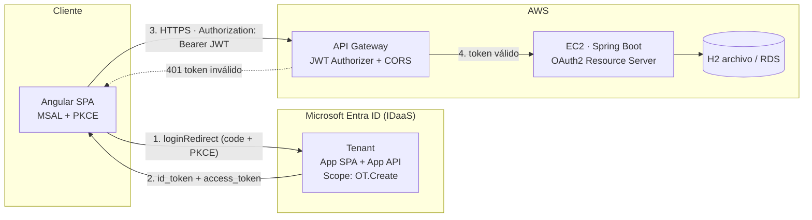
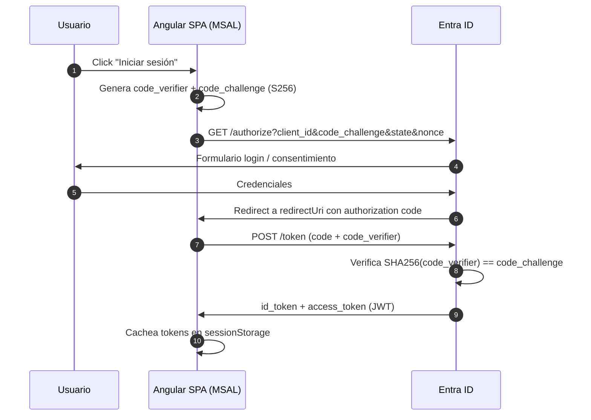
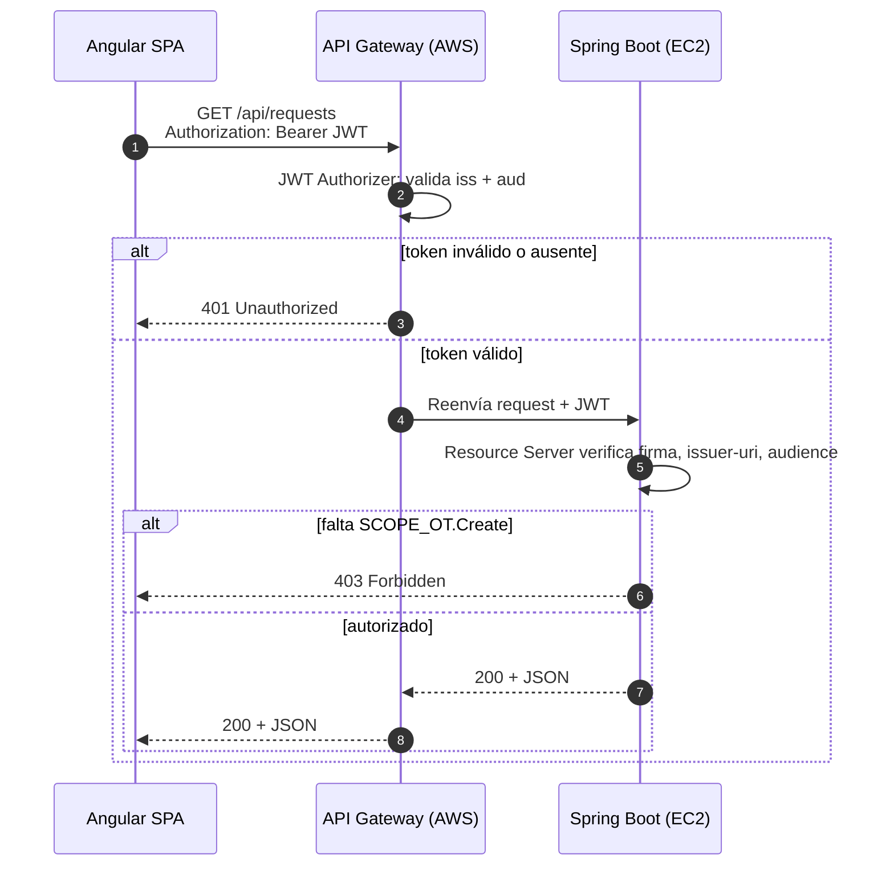

# Pedidos360 — Frontend (Angular + MSAL)

SPA Angular 22 que autentica contra Microsoft Entra ID usando MSAL (Authorization Code Flow + PKCE) y consume el backend a través de AWS API Gateway.

## Arquitectura



## Flujo Authorization Code con PKCE



## Flujo de petición autenticada (validación JWT)



## Archivos clave

| Archivo | Propósito |
|---|---|
| `src/environments/environment.ts` | `clientId`, `tenantId`, `backendScope`, `apiUrl` (API Gateway) |
| `src/app/factories/msal-instance.factory.ts` | `PublicClientApplication` → flujo PKCE, caché en `sessionStorage` |
| `src/app/app.config.ts` | `protectedResourceMap` + `MsalInterceptor` (Bearer automático) |
| `src/app/services/auth.service.ts` | `loginRedirect`, logout, roles desde `idTokenClaims` |
| `src/app/app.routes.ts` | `MsalGuard` en rutas protegidas, `roleGuard` en `/catalog` |
| `src/app/services/order.service.ts` | Llamadas a la API vía API Gateway, manejo de errores 401/403 |

---

This project was generated using [Angular CLI](https://github.com/angular/angular-cli) version 22.1.5.

## Development server

To start a local development server, run:

```bash
ng serve
```

Once the server is running, open your browser and navigate to `http://localhost:4200/`. The application will automatically reload whenever you modify any of the source files.

## Code scaffolding

Angular CLI includes powerful code scaffolding tools. To generate a new component, run:

```bash
ng generate component component-name
```

For a complete list of available schematics (such as `components`, `directives`, or `pipes`), run:

```bash
ng generate --help
```

## Building

To build the project run:

```bash
ng build
```

This will compile your project and store the build artifacts in the `dist/` directory. By default, the production build optimizes your application for performance and speed.

## Running unit tests

To execute unit tests with the [Vitest](https://vitest.dev/) test runner, use the following command:

```bash
ng test
```

## Running end-to-end tests

For end-to-end (e2e) testing, run:

```bash
ng e2e
```

Angular CLI does not come with an end-to-end testing framework by default. You can choose one that suits your needs.

## Additional Resources

For more information on using the Angular CLI, including detailed command references, visit the [Angular CLI Overview and Command Reference](https://angular.dev/tools/cli) page.
